# 🎯 AI Agent QA Suite - Complete System Architecture

**Copy the code below to https://mermaid.live/ and export as PNG/SVG**

```mermaid
graph TB
    %% Title and Legend
    Title["<b>🎯 AI AGENT QA SUITE - Complete System Architecture</b><br/>Professional Testing Framework for AI Chatbots & Agents<br/><br/><i>Flow: Configure → Generate → Test → Analyze → Export</i>"]
    
    %% ==================== USER LAYER ====================
    User([👤 USER<br/>QA Engineer])
    
    %% ==================== UI LAYER ====================
    UI["🖥️ STREAMLIT WEB UI<br/><b>app_v2.py</b><br/>━━━━━━━━━━━━━━<br/>Sidebar: Configuration<br/>4 Testing Tabs + Results"]
    
    %% ==================== CONFIGURATION ====================
    subgraph Config["⚙️ CONFIGURATION LAYER"]
        direction TB
        EP["📡 ENDPOINT CONFIG<br/>━━━━━━━━━━━━━━<br/>• API URL<br/>• Request Field: 'message'<br/>• Response Field: 'response'<br/>• Auth Headers"]
        
        LLM_C["🤖 LLM CONFIG<br/>━━━━━━━━━━━━━━<br/>• Provider: Groq/Gemini/NVIDIA<br/>• Model Selection<br/>• API Keys"]
        
        Seed["🌱 AGENT SEED DATA<br/>━━━━━━━━━━━━━━<br/>• Name & Description<br/>• Domain: E-commerce/Support<br/>• Capabilities<br/>• RAG: Ground Truth Docs"]
    end
    
    %% ==================== GENERATION ====================
    subgraph Gen["🎲 DYNAMIC TEST GENERATION (LLM-Powered)"]
        direction LR
        PGen["Generate Personas<br/>━━━━━━━━━━━━━━<br/>Based on agent domain<br/>5-10 realistic users"]
        SGen["Generate Scenarios<br/>━━━━━━━━━━━━━━<br/>Domain-specific tests<br/>Happy path + Edge cases"]
        RGen["Generate RAG Tests<br/>━━━━━━━━━━━━━━<br/>Questions from docs<br/>+ Expected answers"]
    end
    
    %% ==================== TESTING ENGINE ====================
    subgraph TestEng["🧪 TESTING ENGINE - 4 PHASES"]
        direction TB
        
        Phase1["📋 PHASE 1: FUNCTIONAL TESTING<br/>━━━━━━━━━━━━━━━━━━━━━━━━━━<br/>Mode A: Category-Based (35+ tests)<br/>  • Input Handling (7 tests)<br/>  • State & Knowledge (4 tests)<br/>  • Reasoning & Decisions (5 tests)<br/>  • Output Generation (5 tests)<br/>  • Conversation (5 tests)<br/>  • Error Handling (3 tests)<br/>  • Safety & Constraints (4 tests)<br/>  • Scenarios (4 tests)<br/>  • Persistence (2 tests)<br/><br/>Mode B: Persona-Based<br/>  • Generated + Default Personas<br/>  • Multi-turn conversations<br/>  • LLM Judge evaluation<br/><br/>Mode C: RAG Testing<br/>  • Accuracy vs Ground Truth<br/>  • Hallucination Detection<br/>  • Fact Checking"]
        
        Phase2["🛡️ PHASE 2: SECURITY TESTING<br/>━━━━━━━━━━━━━━━━━━━━━━━━━━<br/>25 Adversarial Attacks:<br/>  🔴 Jailbreak (5 attacks)<br/>  🔴 Prompt Injection (5)<br/>  🟠 Data Extraction (5)<br/>  🔴 Harmful Content (5)<br/>  🟠 Social Engineering (5)<br/><br/>+ Dynamic Attack Generation<br/>7 Mutation Techniques<br/>100-Point Security Rubric"]
        
        Phase3["⚡ PHASE 3: PERFORMANCE<br/>━━━━━━━━━━━━━━━━━━━━━━━━━━<br/>Sequential Load Testing:<br/>  • Latency Metrics<br/>    - Min/Max/Avg<br/>    - P50/P95/P99 percentiles<br/>  • Throughput (req/sec)<br/>  • Error Rate (%)<br/>  • Response Time Distribution"]
        
        Phase4["📈 PHASE 4: LOAD TESTING<br/>━━━━━━━━━━━━━━━━━━━━━━━━━━<br/>Concurrent User Testing:<br/>  • 1-20 simultaneous users<br/>  • Stress Testing<br/>  • Degradation Analysis<br/>  • Concurrent Success Rate"]
    end
    
    %% ==================== CORE COMPONENTS ====================
    subgraph Core["🔧 CORE EXECUTION LAYER"]
        direction TB
        
        Runner["🏃 TEST RUNNER<br/>━━━━━━━━━━━━━━<br/>• Loop through tests<br/>• Track progress<br/>• Error handling<br/>• Result collection"]
        
        LLM_Layer["🤖 LLM LAYER<br/>━━━━━━━━━━━━━━<br/>Functions:<br/>  • simulate_user_message()<br/>  • evaluate_conversation()<br/>  • generate_personas()<br/>  • evaluate_rag_response()"]
        
        Adapter["📡 UNIVERSAL CHATBOT ADAPTER<br/>━━━━━━━━━━━━━━━━━━━━━━<br/>Works with ANY REST API!<br/><br/>Request Building:<br/>  payload = {request_field: message}<br/><br/>Response Extraction:<br/>  Dot notation: 'output.text'<br/>  Walk JSON tree: data['output']['text']<br/><br/>Features:<br/>  • Health check<br/>  • Latency tracking<br/>  • Error handling"]
    end
    
    %% ==================== TEST MODULES ====================
    subgraph Modules["📦 TEST DEFINITION MODULES"]
        direction TB
        M1["<b>functional_tests.py</b><br/>━━━━━━━━━━━━━━<br/>35 test definitions<br/>9 categories<br/>LLM judge evaluator"]
        M2["<b>adversarial_fixtures.py</b><br/>━━━━━━━━━━━━━━<br/>25 baseline attacks<br/>5 attack types<br/>Compliance tags"]
        M3["<b>adversarial_generator.py</b><br/>━━━━━━━━━━━━━━<br/>Dynamic attack generator<br/>7 mutation techniques<br/>Security rubric"]
    end
    
    %% ==================== EXTERNAL SERVICES ====================
    Target["🎯 TARGET CHATBOT<br/>━━━━━━━━━━━━━━<br/>Your AI Agent Under Test<br/><br/>Any REST API:<br/>  • Custom chatbot<br/>  • OpenAI/Claude<br/>  • Internal bot<br/>  • RAG system"]
    
    subgraph LLM_Providers["☁️ LLM PROVIDERS (For Judge & Simulation)"]
        G["⚡ GROQ<br/>llama-3.3-70b<br/>Fast & Free"]
        Gem["🔷 GEMINI<br/>gemini-1.5-flash<br/>Google AI"]
        Nv["🟢 NVIDIA NIM<br/>llama-3.1-8b<br/>Enterprise"]
    end
    
    %% ==================== RESULTS ====================
    subgraph Results["📊 RESULTS & REPORTING"]
        direction TB
        Store["🗄️ SESSION STATE<br/>━━━━━━━━━━━━━━<br/>• all_results[]<br/>• functional_results[]<br/>• security_results[]<br/>• rag_results[]<br/>• generated_personas[]"]
        
        Metrics["📈 METRICS & ANALYSIS<br/>━━━━━━━━━━━━━━<br/>• Pass/Fail Rate<br/>• Score Distribution<br/>• Category Breakdown<br/>• Critical Failures<br/>• Latency Statistics"]
        
        Export["💾 EXPORT OPTIONS<br/>━━━━━━━━━━━━━━<br/>• JSON (full data)<br/>• CSV (summary)<br/>• PDF Reports<br/>• Compliance Reports"]
    end
    
    %% ==================== CONNECTIONS ====================
    
    %% User Flow
    Title -.->|Start Here| User
    User -->|1. Configure| UI
    
    %% Configuration
    UI -->|2. Setup| Config
    EP -.->|API Details| Adapter
    LLM_C -.->|Model Info| LLM_Layer
    Seed -.->|Context| Gen
    
    %% Generation
    LLM_C -->|Use LLM| Gen
    PGen -->|Personas| TestEng
    SGen -->|Scenarios| TestEng
    RGen -->|RAG Questions| Phase1
    
    %% Test Execution
    UI -->|3. Run Tests| TestEng
    Phase1 -->|Sequential| Phase2
    Phase2 -->|Sequential| Phase3
    Phase3 -->|Sequential| Phase4
    
    %% Test Module Integration
    M1 -.->|Definitions| Phase1
    M2 -.->|Attacks| Phase2
    M3 -.->|Dynamic| Phase2
    
    %% Core Execution
    Phase1 -->|Execute| Runner
    Phase2 -->|Execute| Runner
    Phase3 -->|Execute| Runner
    Phase4 -->|Execute| Runner
    
    Runner -->|Simulate| LLM_Layer
    Runner -->|Judge| LLM_Layer
    Runner -->|Send| Adapter
    
    %% External Communication
    Adapter <-->|HTTP POST/GET<br/>Request/Response| Target
    LLM_Layer <-->|API Calls| LLM_Providers
    
    %% Results Flow
    Runner -->|4. Store| Store
    Store -->|Aggregate| Metrics
    Store -->|Generate| Export
    Metrics -->|Display| UI
    Export -->|5. Download| User
    
    %% ==================== STYLING ====================
    classDef titleStyle fill:#2C3E50,stroke:#34495E,stroke-width:4px,color:#ECF0F1,font-size:16px
    classDef userStyle fill:#4A90E2,stroke:#2E5C8A,stroke-width:4px,color:#fff,font-size:14px
    classDef uiStyle fill:#7B68EE,stroke:#5A4AB8,stroke-width:3px,color:#fff,font-size:13px
    classDef configStyle fill:#50C878,stroke:#3A9B5C,stroke-width:2px,color:#fff,font-size:12px
    classDef genStyle fill:#48D1CC,stroke:#3AA8A5,stroke-width:2px,color:#fff,font-size:12px
    classDef testStyle fill:#FF6B6B,stroke:#CC5555,stroke-width:3px,color:#fff,font-size:12px
    classDef coreStyle fill:#FFA500,stroke:#CC8400,stroke-width:2px,color:#fff,font-size:12px
    classDef moduleStyle fill:#FFD700,stroke:#CCB000,stroke-width:2px,color:#333,font-size:11px
    classDef externalStyle fill:#20B2AA,stroke:#178B83,stroke-width:3px,color:#fff,font-size:12px
    classDef resultsStyle fill:#9370DB,stroke:#7356B0,stroke-width:2px,color:#fff,font-size:12px
    
    class Title titleStyle
    class User userStyle
    class UI uiStyle
    class EP,LLM_C,Seed,Config configStyle
    class PGen,SGen,RGen,Gen genStyle
    class Phase1,Phase2,Phase3,Phase4,TestEng testStyle
    class Runner,LLM_Layer,Adapter,Core coreStyle
    class M1,M2,M3,Modules moduleStyle
    class Target,G,Gem,Nv,LLM_Providers externalStyle
    class Store,Metrics,Export,Results resultsStyle
```

---

## 📥 HOW TO EXPORT AS IMAGE:

### Method 1: Mermaid Live Editor (Recommended)
1. Go to **https://mermaid.live/**
2. Delete the default code
3. Paste the entire mermaid code above
4. Click **"Download PNG"** or **"Download SVG"** button
5. Done! You have a high-quality image

### Method 2: VS Code
1. Install extension: **"Markdown Preview Mermaid Support"**
2. Open this file in VS Code
3. Press `Ctrl+Shift+V` (Preview)
4. Right-click diagram → "Copy Image" or use a screenshot tool

### Method 3: GitHub
1. Create a new markdown file in GitHub repo
2. Paste the mermaid code block
3. GitHub auto-renders it
4. Take a screenshot

---

## 🎨 Diagram Features:

✅ **Self-Explanatory**: Every box has description  
✅ **Color-Coded**: Each layer has unique color  
✅ **Complete Flow**: Shows all 5 steps (Configure → Generate → Test → Analyze → Export)  
✅ **Technical Details**: Includes actual file names, function names, API details  
✅ **All 4 Testing Phases**: Functional, Security, Performance, Load  
✅ **High Resolution**: Exports as vector (SVG) or high-res PNG  

---

## 📊 Legend:

| Color | Layer |
|-------|-------|
| 🔵 Blue | User & UI |
| 🟢 Green | Configuration |
| 🔴 Red | Testing Engine |
| 🟠 Orange | Core Execution |
| 🟡 Yellow | Test Modules |
| 🔷 Teal | External Services |
| 🟣 Purple | Results |

**Arrows:**
- Solid `→` = Data flow / Execution
- Dotted `-.->` = Configuration / Setup
- Double `<-->` = Bidirectional communication
