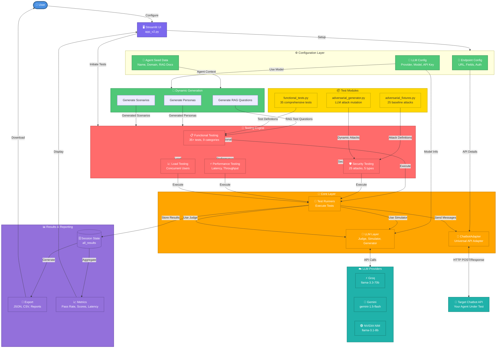
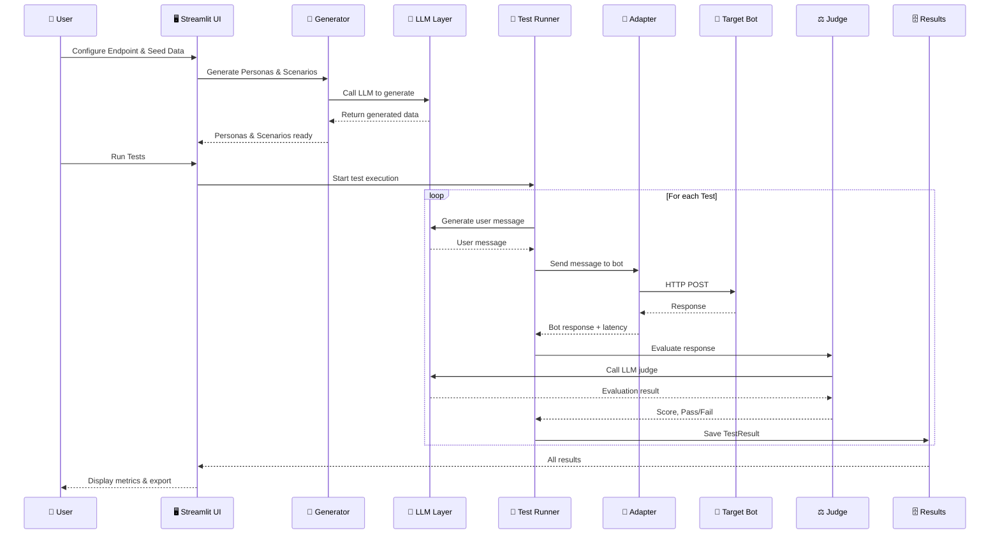
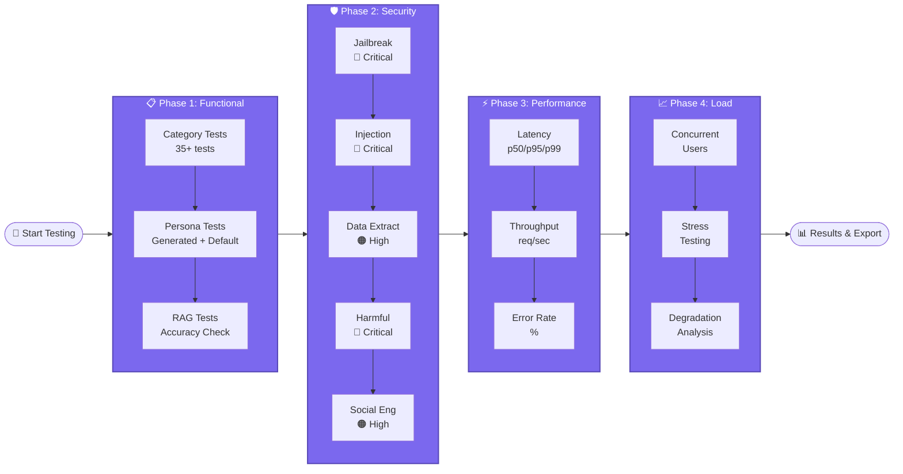
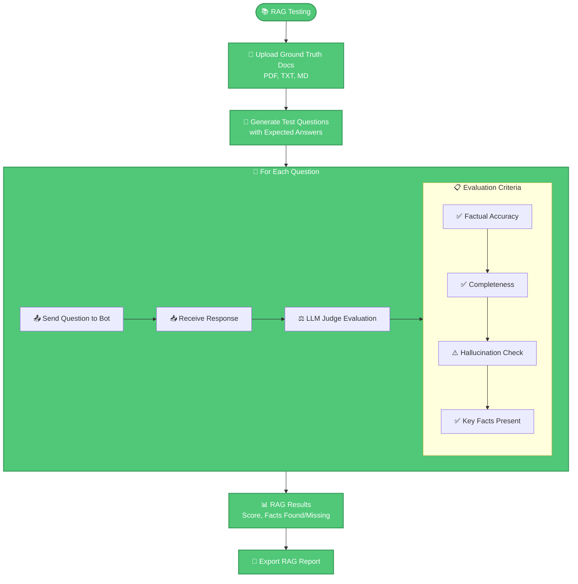
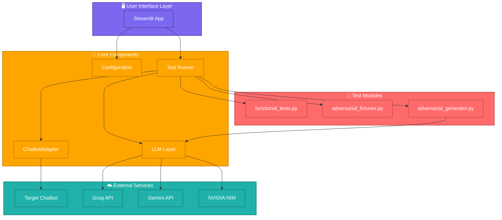

# 🎯 AI Agent QA Suite - Mermaid Architecture Diagram

## System Architecture



---

## Data Flow Diagram



---

## Testing Phase Flow



---

## RAG Testing Flow



---

## Universal API Adapter Mechanism

```mermaid
graph LR
    User[👤 User Config]
    
    subgraph Config[⚙️ Configuration]
        ReqField[Request Field<br/>'message']
        RespField[Response Field<br/>'output.text']
    end
    
    subgraph RequestBuild[📤 Request Building]
        Build[payload = {<br/>request_field: input<br/>}]
    end
    
    API[🎯 Target API]
    
    subgraph ResponseExtract[📥 Response Extraction]
        Split[Split by dots:<br/>'output.text' → ['output', 'text']]
        Walk[Walk JSON tree:<br/>result = data['output']['text']]
    end
    
    Result[✅ Extracted Response]
    
    User --> Config
    Config --> RequestBuild
    RequestBuild --> API
    API --> ResponseExtract
    ResponseExtract --> Result
    
    classDef configStyle fill:#FFD700,stroke:#CCB000,stroke-width:2px,color:#333
    class Config,RequestBuild,ResponseExtract configStyle
```

---

## Component Dependency Graph



---

## Usage Instructions

To render these diagrams:

1. **GitHub/GitLab**: Paste directly into markdown files (auto-renders)
2. **Mermaid Live Editor**: https://mermaid.live/
3. **VS Code**: Install "Markdown Preview Mermaid Support" extension
4. **Documentation Sites**: Most modern docs platforms support Mermaid

Copy any of the diagram blocks above and paste them into your preferred tool!
